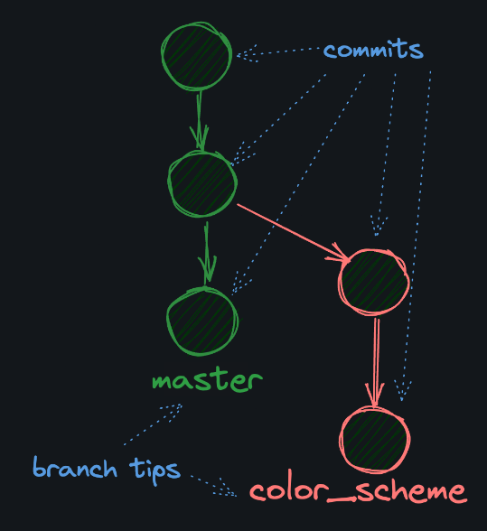

# Branch Nedir?

Git branch farklı değişiklikleri ayrı ayrı takip etmenize olanak tanır.
Örneğin bir projede yeni bir özellik eklemek istediğinizde, bu özelliği geliştirmek için yeni bir branch oluşturabilirsiniz. Bu sayede, projenin ana yapısını bozmadan yeni özelliği geliştirebilirsiniz.



Şu anda hangi branch üzerinde olduğunuzu görmek için `git branch` komutunu kullanabilirsiniz. Bu komut size mevcut branch'leri listeler ve hangi branch üzerinde olduğunuzu gösterir.

```bash
$ git branch
```

Branch ismini değiştirmek için `git branch -m` komutunu kullanabilirsiniz.

```bash
$ git branch -m old-branch-name new-branch-name
```

## Branch Görselleştirme

```bash
A --- B --- F --- G  (master)
         \
          C --- D --- E  (feature)
```

Yukarıdaki örnekte, `master` branch'inde `A`, `B`, `F` ve `G` commit'leri bulunurken, `feature` branch'inde `A`, `B`, `C`, `D` ve `E` commit'leri bulunmaktadır.

### Soru

```bash
          H --- I --- J  (lanes_branch)
         /
A --- B --- C --- D  (master)
  \
    E --- F --- G  (primes_branch)
```

Yukarıdaki örnekte, `lanes_branch` ve `primes_branch` branch'leri hangi commit'ler üzerinde oluşturulmuştur?

## Yeni Branch Oluşturma

```bash
$ git branch new-branch-name
```
veya yeni bir branch oluşturup o branch'e geçmek için

```bash
$ git switch -c new-branch-name
```


# Örnek Bir Senaryo

* add_classic adında bir branch oluşturup, bu branch'e geçin.

```bash
git switch -c add_classic
```

* `add_classic` branch'inde `classic.csv` adında bir dosya oluşturun ve aşağıdaki içeriği ekleyin:

```bash
nano classic.csv
```

```csv
title, director, year
One Crazy Summer, Savage Steve Holland, 1986
The Princess Bride, Rob Reiner, 1987
The Goonies, Richard Donner, 1985
The Breakfast Club, John Hughes, 1985
Monty Python and the Holy Grail, Terry Gilliam, 1975
```
* Dosyayı staging area'ya ekleyin ve commit edin.

```bash
git add classic.csv
git commit -m "C: Add classic.csv"
```
* *git log* komutunu kullanarak commit'i kontrol edin.

```bash
git log
```
