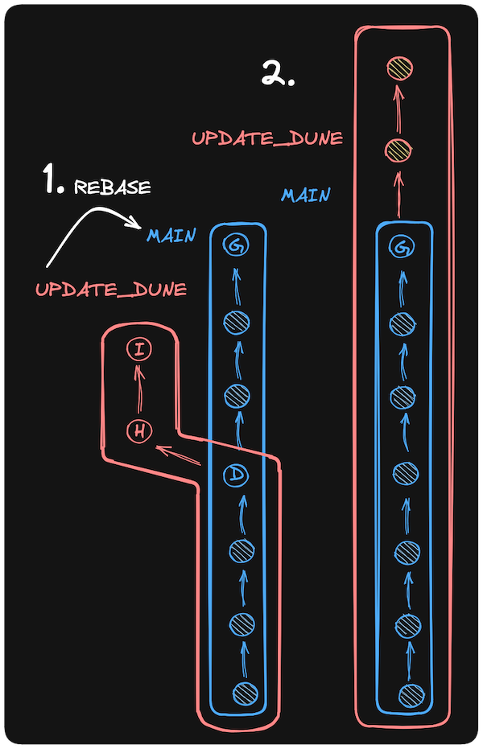

# Merge

* Farklı branch'lerde yapılan değişiklikleri birleştirmek için kullanılır.

```bash
A - B - E      main
     \
      C - D    other_branch
```

```bash
A - B - E - F      main
     \     /
      C - D        other_branch
```

## Örnek Bir Senaryo

*  `add_classics` branch'inde `classic.csv` dosyasını güncelleyelim.

```bash
nano classic.csv
```

```bash
Fight Club, David Fincher ,1999
```

```bash
git add classic.csv
git commit -m "D: Add classic.csv"
```

* `main` branch'ine geçelim ve `contents.md` dosyasını oluşturalım.

```bash
git switch main
```

```bash
nano contents.md
```

```bash
# contents

- titles.md: The movie titles in the WebFlyx collection
- quotes: A directory of files containing memorable quotes from movies
```

```bash
git add contents.md
git commit -m "E: Add contents.md"
```

* `add_classics` branch'ini `main` branch'ine birleştirelim.

```bash
git merge add_classics
```

* Etkileşimli editör açıklacak ve bir commit mesajı girmeniz istenecektir. Aşağıdaki gibi bir commit mesajı girebilirsiniz.

```bash
F: Merge add_classics branch
```

```bash
git log --oneline --decorate --graph --parents
```

```bash
A - B - E - F      main
     \     /
      C - D        add_classics
```

# Rebase

* Farklı branch'lerde yapılan değişiklikleri birleştirmek için kullanılır. Fakat `merge`'den farklı olarak, `rebase` işlemi sonucunda commit geçmişi değişir.

```bash
A - B - C    main
   \
    D - E    feature_branch
```

```bash
A - B - C         main
         \
          D - E   feature_branch
```

* feature_branch'ini `main` branch'ine `rebase` işlemi uygulayarak birleştirelim. 
* Öncelikle feature_branch'ine geçelim.

```bash 
git switch -c feature_branch
```

* Bir örnek dosya oluşturalım.

```bash
nano color.py
```

```python
print("Color dosyası")
```

```bash
git add color.py
git commit -m "H: Add color.py"
```

```bash
nano model.py
```

```python
print("Model dosyası")
```
```bash
git add model.py
git commit -m "I: Add model.py"
```

* Ardından main branch'ine geçelim.

```bash
git switch main
```
* Örnek bir dosya oluşturalım.

```python
nano test.py
```

```python
print("Hello, World!")
```

```bash
git add test.py
git commit -m "G: Add test.py"
```
* Repo commit geçmişi aşağıdaki gibi olacaktır.

```bash

A - B - E - F - G    main
     \     /  \     
      C - D     H - I    feature_branch
```
* Rebase işlemi uygulayarak feature_branch'ini main branch'ine birleştirelim.

```bash
git rebase main
```

```bash
A - B - E - F - G - H - I    
     \     /                feature_branch
      C - D                  
```




# Reset

* `reset` komutu, commit geçmişindeki bir değişikliği geri almak için kullanılır.

```bash
A - B - C - D    main
```

```bash
A - B - C    main
```

## Hard Reset

* `hard reset`, commit geçmişindeki bir değişikliği geri alır ve çalışma dizinindeki dosyaları da değiştirir.

```bash
git reset --hard COMMIT_HASH
```

## Soft Reset

* `soft reset`, commit geçmişindeki bir değişikliği geri alır fakat çalışma dizinindeki dosyaları değiştirmez.

```bash
git reset --soft COMMIT_HASH
```

* Örnek bir senaryo oluşturalım.

```bash
nano deneme.txt
```

```bash
git add deneme.txt
git commit -m "J: Add deneme.txt"
```

```bash
git log --oneline
```

```bash
git reset --soft {COMMIT_HASH}
```

# Remote    

* `remote` komutu, uzak depoları yönetmek için kullanılır. Git, bir projeyi birden fazla kişiyle paylaşmak için kullanılır. Bu nedenle, projenin uzak bir depoda barındırılması gerekebilir. Örnek olarak yeni bir repo oluşturup, bu repoyu uzak bir depo olarak ekleyelim.

```bash
mkdir git-rehberi-remote
cd git-rehberi-remote
git init
```

```bash
git remote add origin {REMOTE_REPO_URL}
```

# Fetch

* `fetch` komutu, uzak depodaki değişiklikleri yerel depoya indirmek için kullanılır. Yalnızca değişiklikleri indirir, yerel dosyaları değiştirmez. 

```bash
git fetch origin main
```

```bash
git log --oneline
```

```bash
git log --oneline origin/main
```

# Remote Merge

* `merge` komutu, uzak depodaki değişiklikleri yerel depoya birleştirmek için de kullanılır.

```bash
git merge origin/main
```

* Fetch ve merge işlemlerini aynı anda yapmak için `pull` komutunu kullanabiliriz.

# Pull

* `pull` komutu, uzak depodaki değişiklikleri yerel depoya indirir ve birleştirir.

```bash
git pull origin main
```

veya

```bash
git pull <remote-branch>
```
# Push

* `push` komutu, yerel depodaki değişiklikleri uzak depoya göndermek için kullanılır.

```bash
git push origin main
```
veya

```bash
git push <local-branch>:<remote-branch>
```


# GitHub Repositories

* GitHub, Git depoları (projeleri) için çevrimiçi en popüler web sitesidir. Yani, merkezi bir web sitesinde "remotes" barındırmak içindir. GitHub birkaç amaca hizmet eder:
    
        - Git depolarınızı depolamak
        - Git depolarınızı başkalarıyla paylaşmak
        - Başkalarının depolarını kopyalamak ve üzerinde çalışmak
        - Başkalarının depolarına katkıda bulunmak
        
# Git != GitHub

* Git ve GitHub, birbirinden farklı şeylerdir. Git, bir versiyon kontrol sistemidir. GitHub ise Git depolarınızı depolamak ve paylaşmak için bir web sitesidir.

# Pull Request ve Merge

* Pull request, bir projeye katkıda bulunmak için kullanılır. Bir pull request oluşturduğunuzda, projenin sahibi değişikliklerinizi inceleyebilir ve projeye eklemek için onaylayabilir.

# Gitignore

* `.gitignore` dosyası, Git'in belirli dosyaları ve klasörleri yoksaymasını sağlar. Bu dosyalar ve klasörler, Git tarafından izlenmez ve depolanmaz.

```bash
nano .gitignore
```

```bash
# Ignore .DS_Store files
.DS_Store
images/
*.log
deneme*
```
