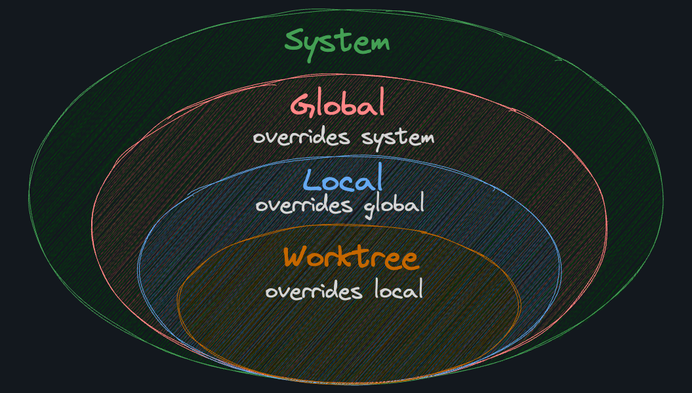

# Status

Bir dosya Git deposunda birkaç durumdan birinde olabilir. İşte önemli olanlardan birkaçı:

* **Untracked**: Dosya, git tarafından izlenmiyor.
* **Staged**: Dosya, bir sonraki committe yer alacak.
* **Commited**: Dosya, git geçmişine eklendi.

* `git status` komutu, dosyaların durumunu kontrol etmek için kullanılır. Öncelikle bir dosya oluşturalım.

```bash
nano deneme.txt
```
* Bazı değişiklikler yapalım.

```bash
Hello, World!
```

* Ardından `git status` komutunu çalıştıralım.

```bash
git status
```

* Bu komut, dosyanın durumunu gösterir. Eğer dosya git tarafından izlenmiyorsa, "Untracked files" olarak gösterilir.


# Staging Area

Staging area, dosyaların bir sonraki committe yer alıp almayacağını belirlemek için kullanılır. Staging area'ya dosya eklemek için `git add` komutu kullanılır.

```bash
git add <path-to-file | pattern>
```

* Örneğin, `deneme.txt` dosyasını staging area'ya eklemek için:

```bash
git add deneme.txt
```

* Tüm dosyaları staging area'ya eklemek için:

```bash
git add .
```

* Staging area'daki dosyaları görmek için:

```bash
git status
```

# Commit

Staging area'daki dosyaları git geçmişine eklemek için `git commit` komutu kullanılır.Bir commit, belirli bir zamandaki deponun anlık görüntüsüdür. Deponun durumunu kaydetmenin bir yoludur ve Git'in projedeki değişiklikleri takip etmesinin yoludur. Bir commit, committe yapılan değişiklikleri açıklayan bir mesajla birlikte gelir.

```bash
git commit -m "commit message"
```

* Örneğin, staging area'daki dosyaları git geçmişine eklemek için:

```bash
git commit -m "A: Add deneme.txt"
```

Bir commit mesajını bozarsanız, `git commit --amend` komutunu kullanarak commit mesajını değiştirebilirsiniz.

```bash
git commit --amend -m "New commit message"
```

# Log

Git log komutu bir depodaki commit'lerin geçmişini gösterir. Git'i bir sürüm kontrol sistemi yapan şey budur. Şunu görebilirsiniz:

* Kim ne zaman bir değişiklik yaptı
* Hangi dosyaları değiştirdi
* Hangi commit mesajını yazdı

Her bir commit'in "commit hash" adı verilen benzersiz bir tanımlayıcısı vardır. Bu, commit'i benzersiz bir şekilde tanımlayan uzun bir karakter dizisidir. Örneğin:

```bash
5ba786fcc93e8092831c01e71444b9baa2228a4f
```
Kolaylık olması açısından, Git içindeki herhangi bir commit'e veya değişikliğe hash'inin ilk 7 karakterini kullanarak başvurabilirsiniz. Bu örnek için bu 5ba786f'dir.

```bash
git log
```

* Bu komut, tüm commitleri gösterir. Eğer sadece son commiti görmek istiyorsanız:

```bash
git log -1
```

# Cat-File

`git cat-file` komutu, bir nesne hakkında bilgi almak için kullanılır. Nesneler, Git'in içindeki her şeyi temsil eder. Bu, commit'ler, dosyalar, klasörler ve daha fazlası olabilir.

```bash
git cat-file -p <object-hash>
```

* Örneğin, bir commit hakkında bilgi almak için:

```bash
git cat-file -p 5ba786f
```

# Diff

`git diff` komutu, dosyalar arasındaki farkları göstermek için kullanılır. Bu, dosyaların içeriğindeki değişiklikleri gösterir.

```bash
git diff
```

* Bir dosyanın içeriğindeki değişiklikleri görmek için:

```bash
git diff <path-to-file>
```

* Staging area'daki dosyalar ile son commit arasındaki farkı görmek için:

```bash
git diff --staged
```

# Trees and Blobs

Git, dosyaları ve klasörleri "blobs" ve "trees" olarak adlandırılan nesnelerle temsil eder. Blobs, dosyaların içeriğini temsil ederken, trees, klasörleri ve içerdikleri dosyaları temsil eder.

* `git cat-file -p` komutunu kullanarak bir blob veya tree hakkında bilgi alabilirsiniz.

```bash
git cat-file -p <object-hash>
```

* Örneğin, bir commit hakkında bilgi almak için:

```bash
git cat-file -p <commit-hash>
```

```bash
> git cat-file -p 5ba786fcc93e8092831c01e71444b9baa2228a4f

tree 4e507fdc6d9044ccd8a4a3061324c9f711c4667d
author ThePrimeagen <the.primeagen@aol.com> 1705891256 -0700
committer ThePrimeagen <the.primeagen@aol.com> 1705891256 -0700

A: Add deneme.txt
```

* Bu çıktı, commit'in bir tree nesnesine işaret ettiğini ve commit mesajını gösterdiğini gösterir. Tree nesnesi, commit'in içindeki dosyaları ve klasörleri temsil eder. Tree nesnesinin hash'ini alarak tree hakkında daha fazla bilgi alabilirsiniz.

```bash
git cat-file -p 4e507fdc6d9044ccd8a4a3061324c9f711c4667d
```

* Bu çıktı, tree nesnesinin içindeki dosyaları ve klasörleri gösterir. Tree nesnesi, ayrıca her bir dosyanın ve klasörün hash'ini alarak daha fazla bilgi alabilirsiniz.

```bash
git cat-file -p <blob-hash>
```
* Bu çıktı, blob nesnesinin içeriğini gösterir. Blob nesnesi, dosyanın içeriğini temsil eder.

# Örnek Bir Senaryo

* titles.md adında bir dosya oluşturalım ve içine birkaç başlık ekleyelim.

```bash
nano titles.md
```

```markdown
# Titles

- A River Runs Through It
- Fight Club
- 12 Years a Slave
- The Big Short
- 12 Monkeys
```

* Ardından, dosyayı staging area'ya ekleyelim ve commit edelim.

```bash
git add titles.md
git commit -m "B: Add titles.md"
```

* Şimdi, cat-file komutunu kullanarak commit hakkında bilgi alalım.

```bash
git log
```

```bash
git cat-file -p <commit-hash>
```
# Locations

Git'in yapılandırılabileceği birkaç konum vardır. Daha genelden daha özele doğru, bunlar şunlardır:

* **System**: /etc/gitconfig dosyası, tüm kullanıcılar ve tüm depolar için yapılandırma ayarlarını içerir.
* **Global**: ~/.gitconfig dosyası, bir kullanıcı ve tüm depolar için yapılandırma ayarlarını içerir.
* **Local**: .git/config dosyası, yalnızca bir depo için yapılandırma ayarlarını içerir.
* **Worktree**: .git/config.worktree dosyası, yalnızca bir çalışma ağacı için yapılandırma ayarlarını içerir.

